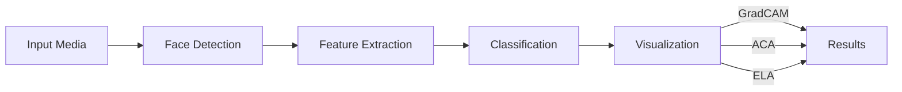

# Deepfake Detection Blueprint

<p align="center"></p>

[](https://github.com/OpenAAIGC/Deepfake-Detection-Blueprint)
[](https://www.python.org/downloads/)
[](LICENSE)

## 🕵️ About

The Deepfake Detection Blueprint is an open-source tool for detecting forms of tampered media, particularly tampering at face region of images and videos. The purpose of the blueprint is to combine a deep learning model that's robust to many sorts of forgery with new heuristics which aim to target characteristics of AI Generated Content (AIGC) when cross-referenced to more traditional methods like Error Level Analysis (ELA)- for instance, ELA the traditional heuristic highlights things like copy move tampering whereas ACA (Advanced Colour Analysis- exclusive to this Blueprint thus far) shows tell-tale signs of diffusion generated imagery- usually, features of forgery that appear very prominently in ELA do not appear in ACA, whereas the other way around sparse highlighted pixels of the same density and distributed evenly unlike the ELA counterpart may hint towards higher likelihood of AIGC. 

<details>
<summary>🔍 Click for summary</summary>

This blueprint uses a combination of:

- Deep learning-based classification
- Visual anomaly approximation  
- Compression inconsistency detection
  
These methods work together to provide a comprehensive assessment of media authenticity- for instance, the model is aimed towards spotting typical deepfake tools , whereas the heuristics are targetting also traditional tampering through ELA but also AI-generated media- it's important to note that the latter are for sake of empowering the user to have some measure of interpretable visual cues but those do differ circumstantially.
</details>

### Key Features

- **Supports Multiple Modalities**: Detect deepfakes in both images and videos (frame-wise)
- **Visual Explanations**: Understand model decisions through multiple visualization techniques:
  - **GradCAM**: Reveals which regions of an image influence the model's classification
  - **ACA (Advanced Colour Analysis)**: Detects color patterns common in AI generated media
  - **ELA (Error Level Analysis)**: Identifies inconsistencies in JPEG compression that may indicate tampering

### Ideal For

- **Researchers**: Studying deepfake technologies and countermeasures
- **Educators**: Demonstrating AI manipulation detection techniques
- **Content Moderators**: Screening potentially manipulated content
- **Tech Enthusiasts**: Learning about computer vision and media forensics

## 🚀 Quick Start

<details open>
<summary><b>💻 Local Installation</b></summary>

```bash
git clone https://github.com/OpenAAIGC/Deepfake-Detection-Blueprint.git
cd Deepfake-Detection-Blueprint

# Create, activate a virtual environment- it's optional but recommended
python -m venv venv
source venv/bin/activate  # On Windows: venv\Scripts\activate

# Install packages
pip install -e .

# Run the demo
streamlit run demo/app.py
```
</details>

> 💡 **Info:** For fastest performance, a CUDA-compatible GPU is recommended but not required.

## 💻 System Requirements

- **OS**: Windows, macOS, or Linux
- **Python**: 3.10 or higher
- **RAM**: 4GB minimum (8GB+ recommended for video analysis)
- **Disk Space**: 300MB for models and code

## 🔍 How It Works

DeepFake Detective combines several key technologies to identify manipulated media:

1. **Face Detection**: Identifies and extracts faces from input media using RetinaFace
2. **Feature Extraction**: Processes facial features through EfficientNet-B4
3. **Classification**: Determines authenticity based on extracted features
4. **Visual Analysis**: Applies visualization techniques to bolster explainability 

### Technical Details

| Component | Specification |
|-----------|---------------|
| 🧠 **Model Architecture** | EfficientNet-B4 - Self Blend CL [(paper)](https://gua.soutron.net/Portal/Default/en-GB/DownloadImageFile.ashx?objectId=5204&ownerType=0&ownerId=2945) |
| 🔍 **Detection Approach** | Analysis of compression artifacts, texture inconsistencies, and facial feature coherence |
| 📊 **Input Size** | Any RGB images- video modality is frame-wise |
| ⚙️ **Framework** | PyTorch + OpenCV |

#### Visualization Methods

- ✨ **GradCAM** - Highlights regions most influential in the model's decision
- 🎨 **ACA** - Advanced Color channel analysis (more heuristics coming soon!)
- 🔎 **ELA** - Identifies JPEG compression inconsistencies through error level analysis



## 📚 Documentation

For detailed documentation, check the `docs/` directory in the repository. Key sections include:

- **Getting Started Guide**: Quick setup instructions
- **Technical Details**: Explanation of the deepfake detection process
- **API Reference**: Documentation for all modules and functions
- **Customization Options**: Ways to extend and modify the tool

## 🔄 Future Development Ideas

Plans on enhancing Deepfake Detection Blueprint with:

- **Video Modality Enhancements**: Including Eulerian Video Magnification to detect pulse patterns and breathing anomalies
- **Audio Analysis**: Expanding detection to audio deepfakes
- **Detection Performance**: Continuously improving accuracy 

See the `docs/future-features-contributions.md` file for more details.

## 🤝 Contributing

Contributions are welcome! Whether it's bug reports, feature requests, code contributions, or documentation improvements, any idea is valuable! See [CONTRIBUTING.md](CONTRIBUTING.md) for details on how to get started.

## 📜 License

This project is licensed under the Apache 2.0 License. See the [LICENSE](LICENSE) file for details.

## 🔗 References 

  Architecture:
- [MAIN-1](https://gua.soutron.net/Portal/Default/en-GB/DownloadImageFile.ashx?objectId=5204&ownerType=0&ownerId=2945)
- [2](https://openaccess.thecvf.com/content/CVPR2022/papers/Shiohara_Detecting_Deepfakes_With_Self-Blended_Images_CVPR_2022_paper.pdf)
- [3](https://github.com/selimsef/dfdc_deepfake_challenge)
 Heuristics:
- [ELA](https://ieeexplore.ieee.org/document/7412439)

---

<p align="center">
  <small>Built with ❤️ for a more honest internet</small>
</p>
